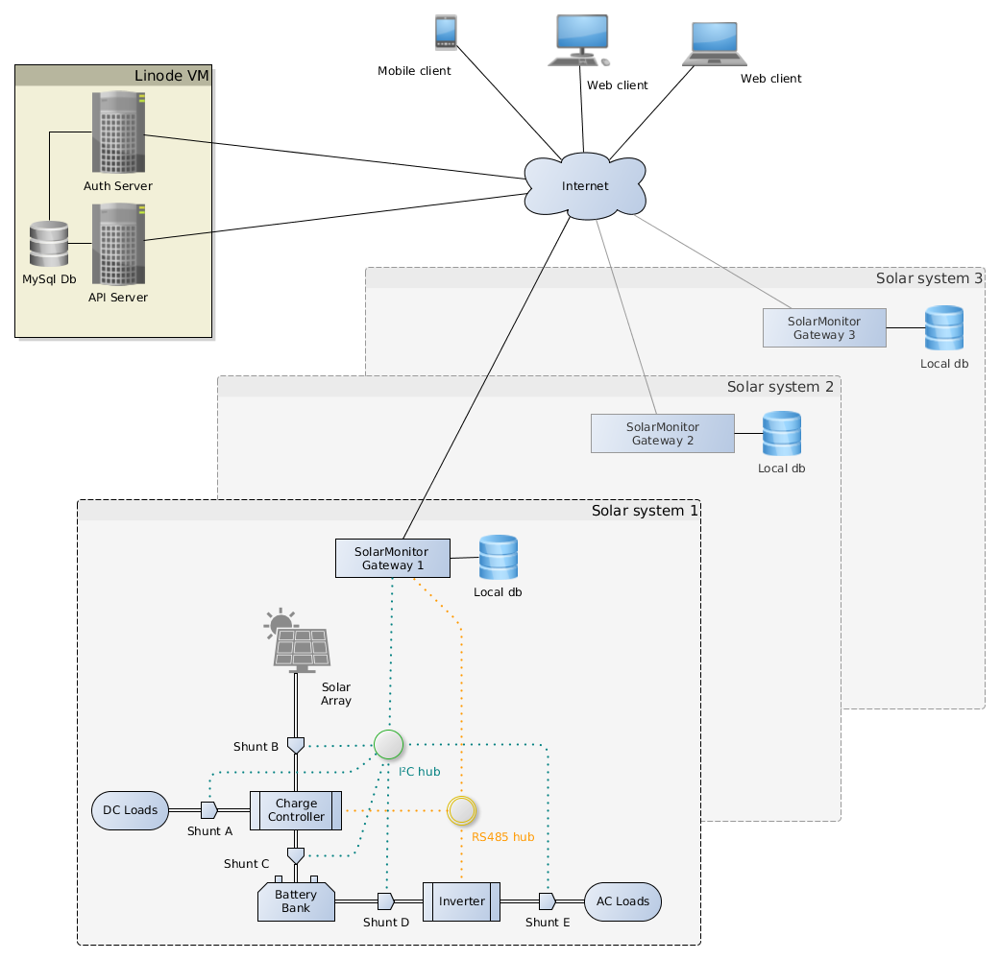

# SolarMonitor

<!-- TOC -->

- [SolarMonitor](#solarmonitor)
    - [Introduction](#introduction)
    - [Overall system](#overall-system)

<!-- /TOC -->

## Introduction

The Solar Monitor project came out of the need to monitor a real off-grid solar system.

The main requirements of the system were:

- allow remote monitoring
- monitor the state of the battery to ensure it does not drop below a certain safe level to maximise its lifespan
- monitor the power used by different home appliances and identify inefficient uses of power
- determine how much energy is produced and consumed each day
- provide historical information to gain an understanding of energy consumption patterns

Monitoring the state of charge of the battery was a critical requirement as the battery bank I have installed uses a Sealed Lead Acid (AGM) technology, which is very sensitive to deep discharges.

In order to suport remote monitoring (and given the patchy Internet at my location), the main part of the system (the SolarMonitorApi) was hosted in a cloud provider (Linode).

## Overall system

The diagram below shows an overview of the entire system:

There are 4 components that form part of the system:

1. The [SolarMonitorApi](<https://github.com/xen22/SolarMonitorApi.git>) - This is an ASP.NET Core Web.Api-based application, hosted in the cloud, which provides a RESTful API allowing remote web clients to pull data related to the various solar systems registered with it.

2. [AuthService](<https://github.com/xen22/AuthService.git>) - this service provides the authentication/authorization for the SolarMonitorApi.

3. The [SolarMonitorGateway](<https://github.com/xen22/SolarMonitorGateway.git>) application. This runs on the individual gateway machines that are installed locally next to the solar systems. Its purpose is to communicate with the individual solar devices and sensors in order to retrieve information from them and push this data to the SolarMonitorApi server. This application was written in Go.

3. SolarMonitorWebClient application. This is an SPA (ReactJS) that obtains data from the SolarMonitorApi and displays it to the user via a selection of graphs.

